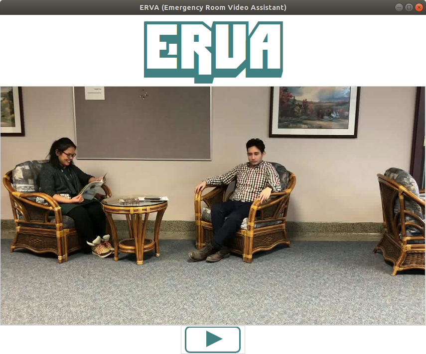

## MLH Hackathon 2018

### Contributors: Chris Cadonic and Cassandra Aldaba

## Project: ERVA - Emergency Room Video Assistant

## Setup

If using anaconda, which is the recommended environment manager for this project, the working environment can be created from the conda environment .yml:

`conda env create -n NAME -f conda_env.yml`

where *NAME* refers to whatever name you wish to call the created environment. If `-n NAME` is not specified, then it will default to the name *hackathon*. If there are errors, it may be due to *conda-forge* not being listed as a channel for anaconda to look for packages, this can be solved by first adding it:

`conda config --add channels conda-forge`

The working environment is also stored in the requirements file *requirements.txt*. Environment can be loaded/updated using pip:

`pip install -r requirements.txt`

A traditional set of python scripts for running the system was setup as follow:

- `main.py`: runs the main program
- `util.py`: contains code for data loading/saving and utility
- `cnn.py`: contains code to implement a neural network model (deprecated)
- `lk.py`: contains code to implement optical flow using hierarchical LK

In either system, the *config.yaml* contains hyperparameters for cnn training and also general parameters (e.g., working paths).

## Running

The script `main.py` will handle running the system as:

`python main.py`

This will start up the ERVA system controlled by a GUI that shows the video capture on the screen. For demonstrative purposes, a video from our pre-recorded video list is used to exemplify the operation of the ERVA system.

Once the system is opened, the following GUI screen is presented:

As shown, the ERVA system continuously plays the video, which in production would be real-time surveillance video, in the center of the window. The play button at the bottom of the screen turns on display and processing of optical flow for motion detection in the video:

These optical flow motion vectors will indicate movement in the video frame, and will compound at particular locations. For locations that consistently show significant amounts of movement, the motion vectors will alter their shading away from green toward more red. If there is a significant amount of movement in the same location around the centroid of a detected patient, then an emergency pop-up window will be presented:

This will alert the nurse or attending staff member to check up on the patient in the waiting area. To ensure the patient is checked on, and to track incidents in the waiting area, the staff member must then report the status of the incident upon returning to ERVA:

This information is automatically saved to an output CSV file *outputFile.csv*, which will track timestamps of events along with the entered information about the incident.

## Data Links

The following are links to the videos used for the project:
* [Heart Attack](https://drive.google.com/open?id=10r1PMPqN7X6u0izZt65rKBxHasT3Op5D)
* [Shrugged Over](https://drive.google.com/open?id=100IbuYzBk02FjJbImcZpKER4xCZmBpiI)
* [Passed Out](https://drive.google.com/open?id=1X9EIen4oR8GP_xclCTCGF7rS3R31T6Mw)
* [Merged Video](https://drive.google.com/open?id=12PwtwjR2nInM2vax1O1lDoEKeSGBpiFg)
* [Background Video](https://drive.google.com/open?id=19JHCbLDqjJEquktmt1KZuQp9zqMNz8mo)

If you wish to test out the ERVA system on these videos, place the videos in the `data/vids/` directory, and specify which video will be analyzed by the *vidPath* variable in *main.py*.